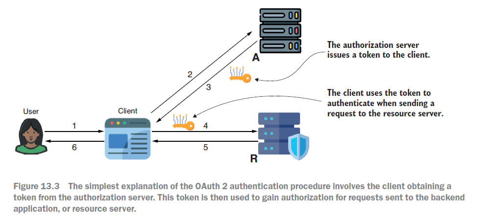
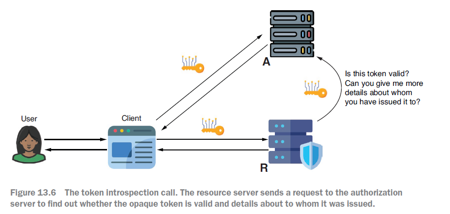
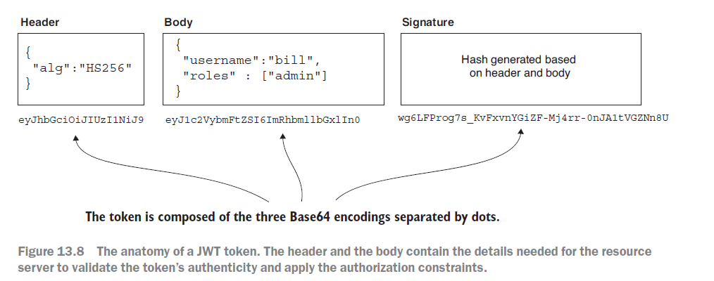
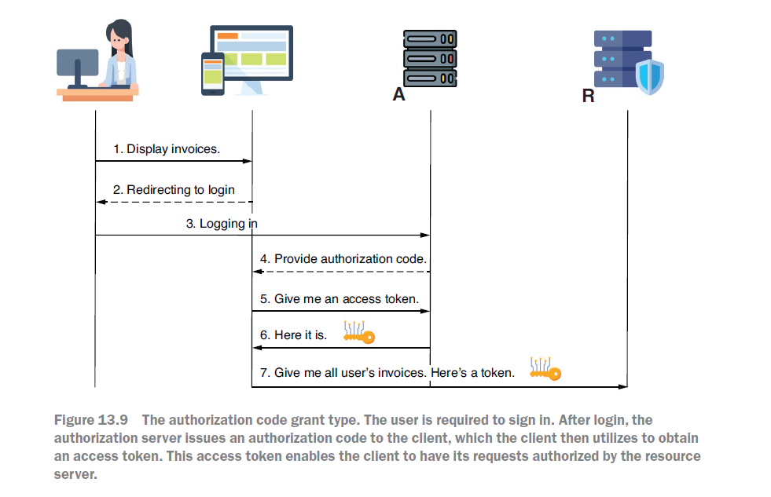
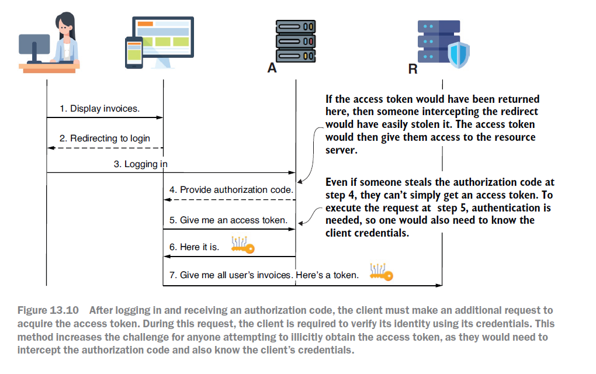
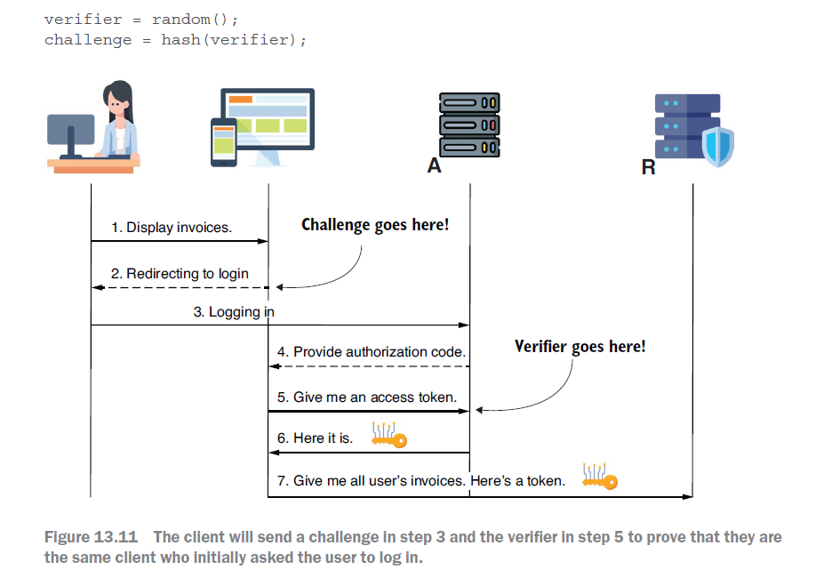
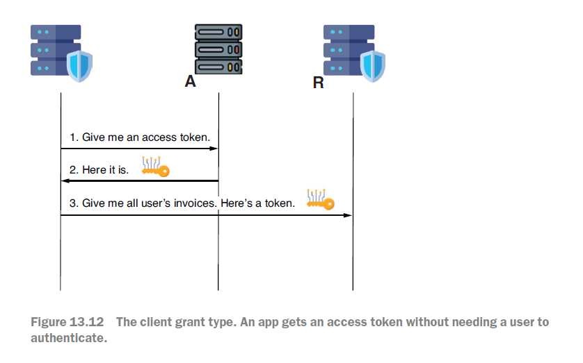
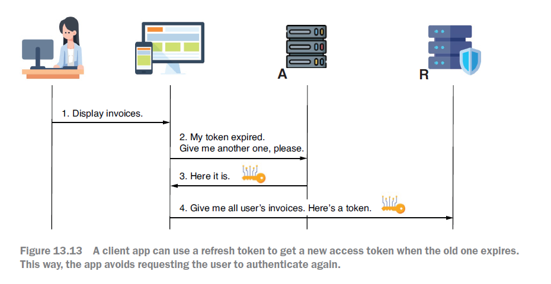

# ch12. OAuth 2가 작동하는 방법

. 개요 및 목적 13장은 OAuth 2와 OpenID Connect를 소개하며, OAuth 2 시스템에서 액세스 토큰의 목적, 발급 및 유효성 검사 방법, 관련된 역할에 대해 설명합니다. 이 장의 목표는 독자가 OAuth 2 및 OpenID Connect에 대한 심층적인 전문 지식을 얻는 것보다는, 이후 14장부터 16장까지의 논의를 이해하는 데 필요한 기본 개념을 제공하는 것입니다.
OAuth 2 및 OpenID Connect는 사용자가 여러 애플리케이션에 대해 별도의 자격 증명을 관리해야 하는 번거로움을 줄이고, 애플리케이션이 자체 인증 기능을 구현하는 데 드는 노력과 사용자 신뢰 문제를 해결하는 데 목적이 있습니다. 2. OAuth 2 시스템의 주요 참여자 (Actors) OAuth 2 시스템에는 다음 네 가지 주요 참여자가 있습니다:

    • User: 애플리케이션을 사용하는 사람으로, 일반적으로 클라이언트를 통해 상호작용합니다.

    • Client: 백엔드 서비스(리소스 서버)로부터 특정 데이터나 기능을 검색하거나 작업하는 애플리케이션으로, 웹 앱, 모바일 앱 또는 다른 백엔드 애플리케이션이 될 수 있습니다.

    • Resource Server: 클라이언트가 호출하는 백엔드 애플리케이션으로, 사용자 및 클라이언트의 리소스를 보호합니다.

    • Authorization Server: 인증 기능을 구현하고 사용자 및 클라이언트 자격 증명과 세부 정보를 안전하게 유지하며, 리소스 접근 권한 증명에 사용될 토큰을 발급하는 구성 요소입니다.

책에서는 사무실 건물에 들어가는 과정을 비유로 들어 이 개념을 설명합니다. 사용자는 방문자이고, 프론트 데스크는 권한 부여 서버, ID는 자격 증명, 액세스 카드는 토큰, 특정 방과 엘리베이터는 리소스에 해당합니다. 3. 토큰 (Tokens) 토큰은 클라이언트가 리소스 서버에 요청을 보낼 때 권한을 부여받기 위해 사용하는 액세스 카드와 같습니다. 토큰은 클라이언트와 사용자 인증을 증명하고, 필요한 경우 클라이언트와 사용자에 대한 추가 정보를 제공합니다. 토큰은 짧은 수명(보통 몇 분, 최대 한 시간)을 가지며, 이는 도난당했을 때 오용을 방지하기 위함입니다.
토큰은 리소스 서버에 권한 부여를 위한 데이터를 제공하는 방식에 따라 두 가지로 분류됩니다:

    • Opaque Tokens: 토큰 자체에는 어떠한 정보도 포함되어 있지 않습니다. 리소스 서버는 권한 부여 서버에 토큰이 유효한지 확인하고 클라이언트 및 사용자에 대한 세부 정보를 얻기 위해 토큰 인트로스펙션(token introspection)을 요청합니다.

    • Non-Opaque Tokens: 토큰 안에 클라이언트와 사용자 정보가 포함되어 있습니다. 가장 일반적인 구현은 **JWT (JSON Web Token)**입니다. JWT는 헤더, 바디(페이로드), 서명의 세 부분으로 구성되며, 서명을 통해 토큰의 위변조 여부를 확인할 수 있습니다. 4. 토큰 획득을 위한 권한 부여 방식 (Grant Types) 권한 부여 방식(grant type)은 클라이언트가 권한 부여 서버로부터 토큰을 얻는 과정을 의미합니다. 이 책에서는 주로 사용되는 세 가지 방식을 다룹니다. (보안 문제로 인해 Implicit 및 Password grant type은 더 이상 권장되지 않습니다).

    • 권한 부여 코드 권한 부여 방식 (Authorization Code Grant Type): 현재 가장 많이 사용되는 방식입니다. 사용자가 클라이언트 앱에서 로그인하면, 클라이언트는 권한 부여 서버로 사용자를 리디렉션하여 로그인하도록 합니다. 로그인 성공 후, 권한 부여 서버는 클라이언트에 '권한 부여 코드(authorization code)'를 제공하고 클라이언트로 리디렉션합니다. 클라이언트는 이 코드를 사용하여 (자체 자격 증명과 함께) 액세스 토큰을 요청합니다. 이는 액세스 토큰이 리디렉션을 통해 직접 노출되는 것을 방지하여 보안을 강화합니다.

    • PKCE (Proof Key for Code Exchange) 보호 적용: 권한 부여 코드 흐름의 보안을 강화하는 추가 기능입니다. 클라이언트는 무작위 '검증자(verifier)'를 생성하고 이를 해싱하여 '챌린지(challenge)'를 만듭니다. 챌린지는 사용자 로그인 요청 시 전송되고 (3단계), 검증자는 액세스 토큰 요청 시 전송됩니다 (5단계). 이는 권한 부여 코드와 클라이언트 자격 증명이 도난당하더라도 액세스 토큰을 획득하기 어렵게 만듭니다.

    • 클라이언트 자격 증명 권한 부여 방식 (Client Credentials Grant Type): 사용자 개입 없이 애플리케이션 간에 (서비스-투-서비스) 권한을 부여할 때 사용됩니다. 클라이언트는 자체 자격 증명만으로 권한 부여 서버로부터 액세스 토큰을 직접 요청합니다.

    • 새 액세스 토큰 획득을 위한 리프레시 토큰 (Refresh Tokens): 액세스 토큰의 수명이 만료되었을 때, 사용자가 다시 인증할 필요 없이 새로운 액세스 토큰을 얻기 위해 사용됩니다. 5. OpenID Connect의 역할 OpenID Connect (OIDC)는 OAuth 2 프레임워크를 기반으로 하는 프로토콜입니다. OAuth 2가 주로 클라이언트 권한 부여에 초점을 맞추는 반면, OIDC는 사용자 인증(identity provider 역할)에 추가적인 기능을 제공합니다. OIDC에서는 'grant type'을 'flow'로, 'authorization server'를 'identity provider' (IdP)로 지칭하는 경우가 많습니다. 6. OAuth 2의 잠재적 취약점 OAuth 2 역시 완벽하지 않으며, 구현 방식에 따라 잠재적인 취약점이 있을 수 있습니다. 개발 시 이러한 취약점을 인지하고 방지하는 것이 중요합니다

