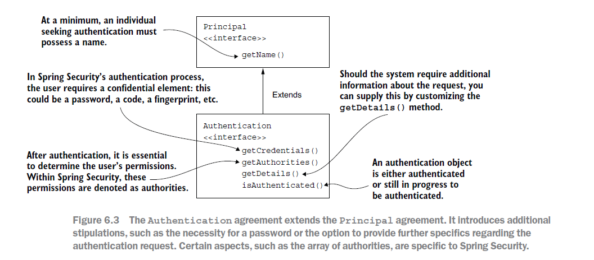
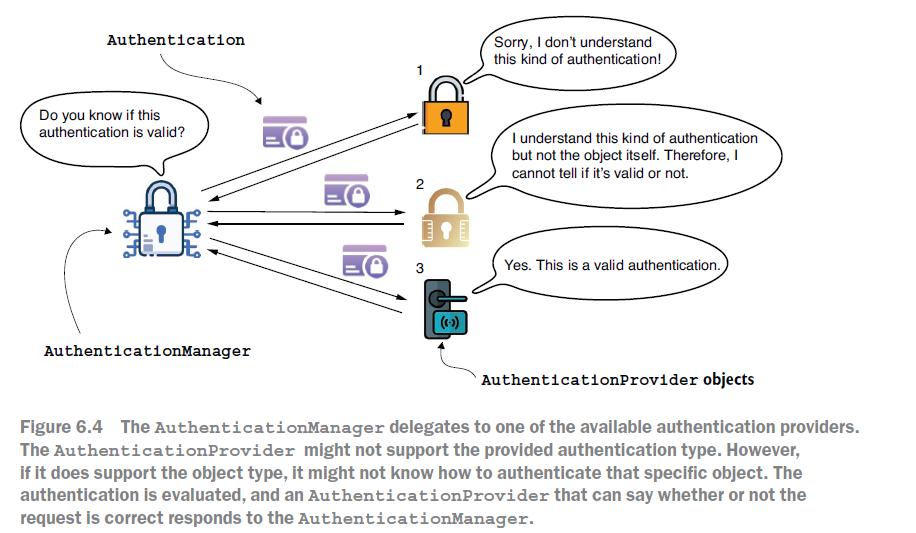
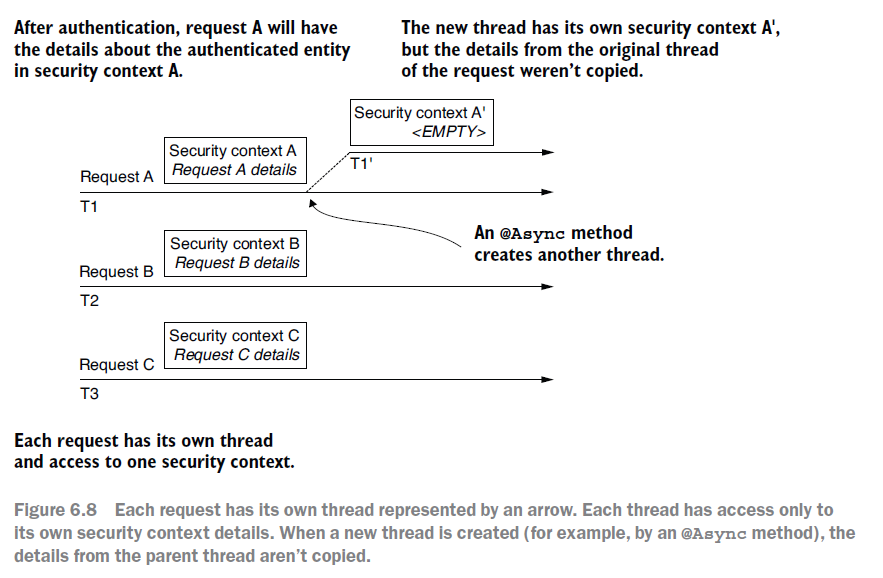
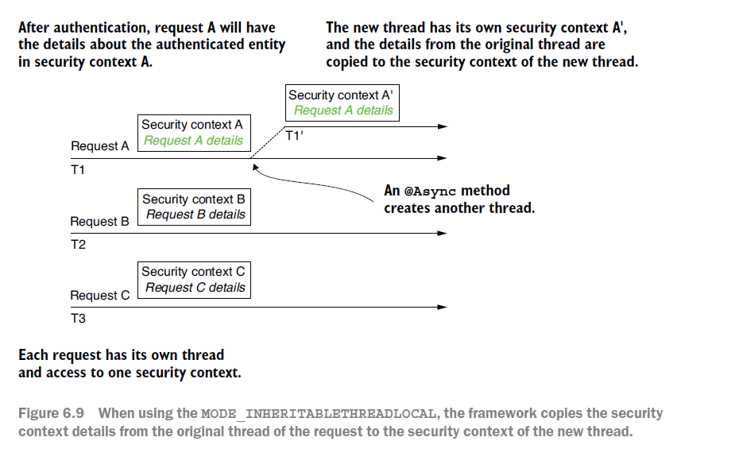

# ch5. 인증 구현

## AuthenticationProvider의 이해

- AuthenticationProvider : 맞춤형 인증 논리를 정의할 수 있다.

- Authentication : 인증 요청 이벤트를 나타내며 애플리케이션에 접근을 요청한 엔티티의 세부 정보를 담는다.

- Principal : 애플리케이션 접근을 요청하는 사용자.



- Authentication interface에서 주요 메서드는 아래와 같다.

  1. isAutehnticated() : 인증 프로세스가 끝났으면 true를 반환하고 아직 진행 중이면 false를 반환한다.
  2. getCredentials() : 인증 프로세스에 이용된 암호나 파일을 반환한다.
  3. getAuthorities() : 인증된 요청에 허가된 권한의 컬렉션을 반환한다.

- authenticate() 메서들 구현 방법

  1. 인증이 실패하면 메서드는 AuthenticationException을 투척해야 한다.
  2. 메서드가 현재 AuthenticationProvider 구현에서 지원되지 않는 인증 객체를 받으면 null을 반환해야 한다. 이렇게 하면 HTTP 필터 수준에서 분리된 여러 Authentication 형식을 사용할 가능성이 생긴다.
  3. 메서드는 완전히 인증된 객체를 나타내는 Authentication 인스턴스를 반환해야 한다. 이 인스턴스에 대해 isAuthenticated() 메서드는 true를 반환하며, 여기에는 인증된 엔티티의 모든 필수 세부 정보가 포함된다.

- AuthenticationProvide의 supports(Class<?> authentication) 메서드는 현재 AuthenticationProvider가 Authentication 객체로 제공된 형식을 지원하면 true를 반환하도록 구현한다. 주의할 점은 이 메서드가 객체에 대해 true를 반환해도 authentiat() 메서드가 null을 반환해 요청을 거부할 수 있다는 점이다.



- AuthenticationProvider 구현 과정
  1. AuthenticationProvider 계약을 구현하는 클래스를 선언한다.
  2. 새 AuthenticationProvider가 어떤 종류의 Authentication 객체를 지원할지 결정한다.
     - 정의하는 AuthenticationProvider가 지원하는 인증 유형을 나타내도록 supports(Class<?> c) 메서드를 재정의한다.
     - authenticate(Authentication a) 메서드를 재정의해 인증 논리를 구현한다.
  3. 새 AuthenticationProvider 수현의 인스턴스를 스프링 시큐리티에 등록한다.

## SecurityContext 이용

- SecurityContext : Authenticaton 객체를 저장하는 인스턴스.

```java
public interface SecurityContext extends Serializable {
    Authentication getAuthentication();
    void setAuthentication(Authentication authentication);
}
```

- SecurityContextHolder : SecurityContext를 관리하는 객체.
- SecurityContext 전략들
  1. MODE_THREADLOACAL : 각 스레드가 보안 컨텐스트에 각자의 세부 정보를 저장할 수 있게 해준다. 요청당 스레드 방식의 웹 애플리케이션에서는 각 요청의 개별 스레드를 가지므로 이는 일반적인 접근법이다.
  2. MODE_INHERITABLETHREADLOCAL : MODE_THREADLOCAL과 비슷하지만 비동기 메서드의 경우 보안 컨텍스트를 다음 스레드로 복사하도록 스프링 시큐리티에 지시한다. 이 방식으로 @Async 메서드를 실행하는 새 소레드가 보안 컨테스트를 상속하게 할 수 있다.
  3. MODE_GLOBAL : 애플리케이션의 모든 스레드가 같은 보안 컨텍스트 인스턴스를 보게 한다.




```java
 @Bean
 public InitializingBean initializingBean() {
    return () -> SecurityContextHolder.setStrategyName(SecurityContextHolder.MODE_INHERITABLETHREADLOCAL);
 }
```

## HTTP Basic 인증 설정

```java
 @Bean
    public SecurityFilterChain filterChain(HttpSecurity http) throws Exception {
        http.csrf(csrf -> csrf.disable())
            .httpBasic(basic -> basic.realmName("LUNA")
                .authenticationEntryPoint(new CustomEntryPoint()))
            .authorizeHttpRequests(authorize -> authorize.anyRequest().authenticated())
        ;

        return http.build();
    }
```

- basic.realmName("LUNA") : 해당 설정을 통해 영역 이름을 "LUNA"로 변경할 수 있다.

* authenticationEntryPoint : 인증이 실패했을 때의 응답을 맞춤 구성할 수 있는 설정.
